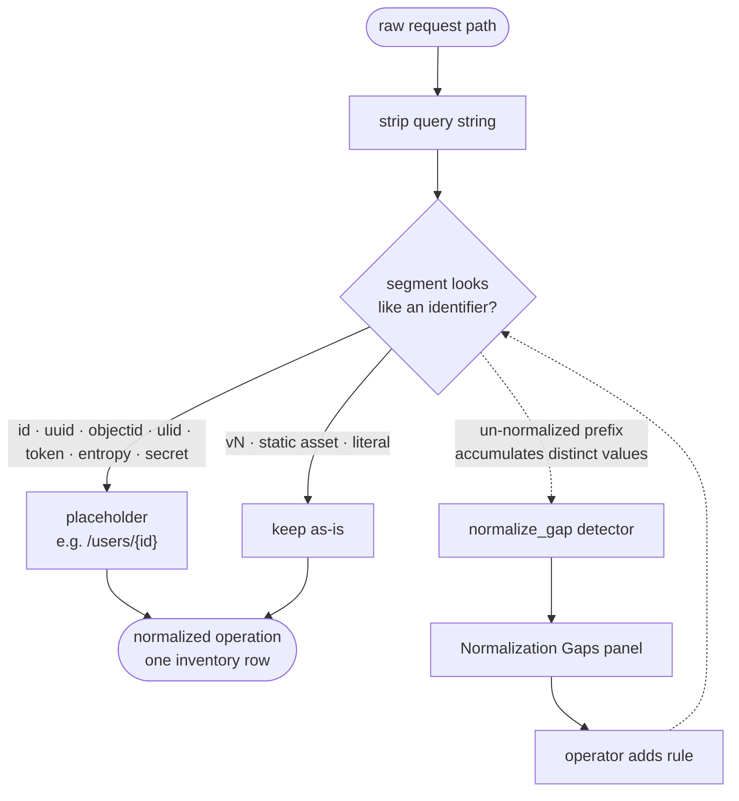

An API endpoint is an *operation* — a method plus a path *template* like `GET /users/{id}` — not a distinct URL per resource ID. If the collector stored raw paths, `/users/1`, `/users/2`, and `/users/999999` would each spawn their own inventory row, and a busy endpoint would shatter into thousands of near-duplicates. Path normalization templates high-cardinality segments into placeholders so that **one operation is one inventory row**.

:::info[Why it matters]
The inventory is cardinality-capped (100K endpoints per collector by default). Un-normalized IDs burn through that budget fast and drown the real catalog in noise. Good normalization keeps the catalog small, stable, and meaningful. See [Overview](/api-discovery/overview).
:::

## What gets normalized automatically

The built-in detectors template a segment into a placeholder when it looks like an identifier. Recognized shapes:

- Numeric IDs, composite-numeric IDs and dates (e.g. `1-101672939043002`, `2024-11-05`)
- UUIDs (bare or embedded), Mongo ObjectIDs, ULIDs, long hex IDs
- JWT-like segments and high-entropy / random tokens
- Leaked vendor secrets (AWS `AKIA…`, GitHub `ghp_…`, Stripe `sk_live_…`, Slack, Shopify, GitLab) → `{secret}` (the value is dropped)

**Preserved as-is:** `vN` version segments (`/v1`, `/v2`) and static-asset segments — these are meaningful literals, not identifiers.

**Learned, not guessed:** letter+digit segments such as `sku-1`, `user42` or `ord_7f3a` are *not* templated on sight — see [Learned templating](#learned-templating) below.

The query string is **always stripped** from the path before storage, regardless of normalization (only accepted parameter **names** are kept, separately).

At a glance — raw path in, one stable operation out; un-normalized prefixes branch to the gap workflow:



### Placeholder kinds

The placeholder set is fixed — a downstream dashboard can rely on it never sprouting new members without a schema migration:

| Placeholder | Meaning |
|---|---|
| `{id}` | Generic identifier (numeric / hex / composite) |
| `{uuid}` | UUID |
| `{objectid}` | Mongo ObjectID |
| `{ulid}` | ULID |
| `{token}` | Opaque auth-ish token (also a leaked JWT in a path → `jwt_in_path`) |
| `{dynamic}` | High-entropy / random value |
| `{secret}` | Leaked vendor credential (value dropped → `secret_in_path`) |
| `{traversal}` | Path-traversal shape |
| `{pii}` | A segment that matched a PII detector |

When an operator adds a rule (below), only these placeholders are selectable: **`id`, `uuid`, `objectid`, `ulid`, `token`, `dynamic`**. `secret`, `pii`, and `traversal` are detector-driven and not operator-assignable. Constraining the set keeps downstream dashboards stable — operators map to existing placeholders rather than inventing new ones.

## Learned templating

A segment made of letters **and** digits is ambiguous: `sku-1` is an id, `oauth2` and `route53` are words. Instead of guessing, the collector **learns** per position:

- A letter+digit segment (≥ 4 characters, at most one `-` / `_`, not a `v<digit>` version) that no built-in detector or operator rule matched is a **candidate**. It stays literal in the stored path for now.
- Candidates are counted per **position** — `(project, listener, method, parent path, segment index)`. Once at least `policy.path_learn_min_distinct` distinct values (default **5**, 2–64) were seen at a position, it is **learned**: from then on that position is `{id}`. The collector stores only short value hashes (at most `policy.path_learn_cap`, default 64, 8–256) and up to 5 non-PII samples.
- Known literal families (`oauth2`, `s3`, `sha256`, `x509`, `route53`, `office365`, `utf-8`, `iso8601`, `node18`, `top10`, `1080p`, …) and anything in `policy.never_template_segments` (≤ 256 lowercase values) never learn — they stay literal even under a learned position. Operator rules always win.
- Every replica reloads the learned set every 30 seconds, so a learned position takes effect within about 30 seconds. Positions resolve left to right; a path with several candidate positions converges in as many rounds.

### The merge job

When a position is learned, the literal rows written before it (`/up/skus/sku-1`, `/up/skus/sku-2`, …) are folded into the `{id}` row by a leader-elected **merge job**: counters and histograms are summed, first/last seen take the min/max, flag and PII sets are unioned, per-flag last-seen stamps keep the newest, capped samples are refilled. Each merge is recorded in an audit list (kept 90 days) with the template path, the merged literal paths and their count.

What a merge means elsewhere:

- The inventory id of a merged literal row answers **410 Gone** with the template it was merged into, so old links resolve.
- Ownership overrides made on merged literal rows apply to the template; [drift](/api-discovery/drift) reports the merge once as **templated** instead of removed + new.
- ClickHouse history stays literal; new traffic aggregates under the template.

### Pinning and unlearning

Admins/Owners manage learned positions under **Settings → API Discovery → Learned path shapes** (the Listeners tab links there). Each position shows its parent template, distinct count, samples, state (`candidate` / `learned`) and the literal rows waiting to merge. An override pins a position:

- **Template** — treat it as `{id}` now, regardless of the distinct count; the merge runs on the next pass.
- **Literal** — never template it. This affects **new traffic only**; rows that were already merged are not split back.

The collector applies an override within about 30 seconds. A merges view lists every merge with its template and merged paths.

## Operator normalization rules

Deployment-specific ID formats the built-ins don't recognize can be added by an operator via `policy.path_normalize_patterns` — no code change, hot-reloaded:

```js
db.api_collector_config.updateOne(
  { _id: "default" },
  { $set: { "policy.path_normalize_patterns": [
      { regex: "tkt_[a-z0-9]+",  placeholder: "dynamic" },
      { regex: "ORD\\d{6,}",     placeholder: "id" }
  ], version: 4, updated_at: new Date(), updated_by: "spehlivan" }}
)
```

Rules of the road:

- Each rule matches a **whole path segment**. Patterns are whole-segment anchored automatically — a leading `^` / trailing `$` is accepted but redundant.
- **Built-in detectors always win.** A custom pattern only ever catches a shape the built-ins missed; it never overrides one.
- `placeholder` must be one of the six operator-assignable kinds. Pick the one that describes the value.
- Patterns are **validated at load time**: each regex must compile, stay within length / quantifier caps, and must not be broad enough to template static segments (`.*`, `[a-z]+` are rejected). A bad pattern fails the reload and the previous config stays live. Max 64 patterns.
- On every reload the collector logs `runtime config reloaded … normalize_patterns=N` — confirm `N` matches what you set (a rejected reload keeps the old value).

:::note[Leaked credentials in a path]
When normalization collapses a vendor secret or JWT in the path to `{secret}` / `{token}`, the raw value is dropped and the event gains the `secret_in_path` / `jwt_in_path` PII category plus the `pii_observed` flag. See [PII, Auth & Consumers](/api-discovery/pii-and-auth).
:::

## The normalization-gap detector

When a deployment-specific ID format slips past the built-ins, each value spawns its own inventory row and the catalog bloats. The `normalize_gap` detector catches this automatically: it counts distinct **literal** last path-segments per `(project, prefix)`, and once a prefix exceeds the threshold (default 64 distinct segments within the window) it records the prefix in the `api_collector_normalize_gaps` collection.

- Already-templated segments (`{id}`, `{uuid}`, …) are ignored, so a correctly-normalized endpoint never appears. Plain lowercase-word last segments (static sub-routes) are ignored too.
- Letter+digit ids are handled by [learned templating](#learned-templating); the gap list covers the other shapes.
- Gap documents are TTL-indexed (7 days): once an operator adds a matching pattern, the segments become placeholders, the prefix stops accumulating, and its entry ages out automatically.

### The Normalization Gaps panel

The UI surfaces these suspected gaps in a **Normalization Gaps** panel with a one-click fix:

- Each row shows a ballooning prefix (e.g. `/api/v1/tickets/by-number`) and when it was last updated.
- An **Admin** or **Owner** sees an *"Add normalize rule"* button per row that opens a modal:
  - **Segment regex** — an RE2 regex matching the whole dynamic segment (no `^`/`$` needed), e.g. `TK-\d+-[A-Z]` or `[0-9a-f-]{36}`.
  - **Placeholder** — a dropdown of the six operator-assignable kinds (`{id}`, `{uuid}`, `{objectid}`, `{ulid}`, `{token}`, `{dynamic}`).
- Submitting appends the rule to `policy.path_normalize_patterns` (a read-modify-write of the collector config). The collector picks it up on its next poll — **applied within ~2 minutes**.
- A clean state renders *"No normalization gaps — all path prefixes look healthy."*

Editing the collector config is restricted to Admin/Owner roles; other users see the gaps but not the add-rule action.

## Worked example

Suppose your ticketing API uses IDs like `TK-48213-A`. The built-in detectors don't recognize them, and with two separators they are not [learned-templating](#learned-templating) candidates either (a single-separator id such as `TK-48213` would be learned automatically). Traffic looks like:

```
GET /api/v1/tickets/TK-48213-A
GET /api/v1/tickets/TK-91007-C
GET /api/v1/tickets/TK-33540-B
… hundreds more distinct TK-* values
```

Each distinct value creates its own inventory row. Once the prefix `/api/v1/tickets` crosses the gap threshold, it appears in the Normalization Gaps panel. An operator clicks **Add normalize rule**, enters:

- **Segment regex:** `TK-\d+-[A-Z]`
- **Placeholder:** `id`

Within ~2 minutes the collector applies it, and all of those rows collapse into a single operation:

```
GET /api/v1/tickets/{id}
```

The gap document stops being refreshed and ages out, and the catalog is clean again.

## Related

- [Collector Configuration](/api-discovery/collector-configuration) — `path_normalize_patterns`, `path_learn_*`, `never_template_segments` and other runtime knobs.
- [Drift & Snapshots](/api-discovery/drift) — how merges appear in the change feed.
- [PII, Auth & Consumers](/api-discovery/pii-and-auth) — how `{secret}` / `{pii}` masking ties into PII detection.
- [OpenAPI Export](/api-discovery/openapi-export) — normalized operations become the paths of the exported spec.
