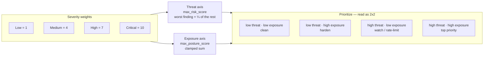

Every endpoint in the catalog is scored on **two independent axes**, not one. This is the model's core idea: *"is it being attacked?"* and *"is it vulnerable?"* are different questions, and collapsing them into a single number would let a storm of ordinary misconfiguration flags drown out one real attack — or vice versa.

## The two axes

| Axis | Field | Question | Nature |
|---|---|---|---|
| **Threat** | `max_risk_score` | Is something dangerous happening *right now*? | An **event** — active attack / abuse |
| **Exposure** | `max_posture_score` | How open / vulnerable is the endpoint *standing still*? | A **state** — config hygiene |

At a glance — severity weights feed the two independent axes, which combine as a 2x2 for prioritization:



- **Threat** collects the **active-finding** flags: BOLA, BFLA, brute-force, scanner / vuln-probe / path-scan, replay, rate & IP anomalies, PII leak, oversized response, latency/error-rate anomaly, sensitive-path keyword, threat-intel hit.
- **Exposure** collects the **standing-posture** flags: anonymous access, plain-text / weak / legacy TLS, missing HSTS / CSP / X-Frame-Options / X-Content-Type-Options, permissive CORS, version disclosure, weak token TTL, internal / external host.

The UI renders them in distinct colour families (Threat = red family, Exposure = blue/purple) so the two scales never read as the same number. Which axis a flag feeds is defined by a fixed **posture-flag set**, not by the flag's class — the following flags feed Exposure; everything else feeds Threat:

```
internal_host, external_host, unauthenticated, plain_text_transport,
legacy_protocol, weak_tls_version, missing_hsts, missing_csp,
missing_x_frame_options, missing_x_content_type_options,
version_disclosure, permissive_cors, weak_token_ttl
```

## Severity weights

Each risk flag has a coarse 1–10 severity weight. Operators tune at the score level, not by re-weighting individual flags:

| Severity | Weight | Meaning |
|---|---|---|
| **Critical** | 10 | Exploitable now — no further pivot needed |
| **High** | 7 | High-confidence attack signal or hardened-posture failure |
| **Medium** | 4 | Suggestive state — normal in moderation, alert on clusters |
| **Low** | 1 | Ambient context |

Per request, the two axes are computed and the endpoint keeps the **max** ever seen on each:

- **Threat** is **max-anchored**: the single worst active finding's severity, plus the remaining active findings at ¼ weight (clamped to 255). So a lone Critical outranks a pile of Mediums, and concurrent findings still add — but gently.
- **Exposure** is the **clamped sum** of the standing posture-flag severities (plus ambient outcomes like `error_status`).

Both `max_risk_score` and `max_posture_score` in the inventory are `$max`-merged — they track the **worst request ever seen** on the endpoint.

:::note[Ordinary backend errors don't inflate Threat]
A 5xx storm or a missing security header raises **Exposure**, never Threat. `risk_score` ranks by danger, not by misconfiguration or ordinary errors — so the top of a Threat-sorted list is real attack signal.
:::

The UI bands the combined score for badge colour: `0` none · `1–9` low · `10–24` medium · `25–39` high · `40+` critical.

## Current vs lifetime

The inventory scores are **monotonic** — they only ever rise. That is correct for "worst ever" but useless for "is it still bad?". So the Threat badge overlays a **current** window on top of the lifetime max, using the ClickHouse rollups:

- **Current** = the max threat over the **last 7 days** (ClickHouse-backed). This is the headline when available.
- **Lifetime** = the all-time `max_risk_score`. Shown when ClickHouse is offline, and always available on hover. Sorting is always on the lifetime score.

Two derived states surface on the badge:

- **Dormant** (a moon icon) — no traffic in the current window. The badge dims and shows the lifetime max; the endpoint isn't currently active.
- **Improved** (a green ↓) — the current score is *below* the all-time peak: the endpoint was remediated (or the attack stopped). It reads as fixed instead of stuck at its historical worst.

If the current-vs-ever overlay is unavailable (ClickHouse offline), the view falls back to lifetime max with a clear inline note — the lifetime max never self-lowers, so it's the safe fallback.

## Security Score (A–F grade)

The **Security Score** dashboard rolls the mix of threat and exposure signals across a surface into a single **A–F** posture grade, with the contributing factors called out. It's the number for a stakeholder summary and for tracking posture release-over-release. See [Discovery Dashboards](/api-discovery/dashboards#security-score).

## Flag classes

Independently of the threat/exposure axis, each flag carries a **class** — the dimension it belongs to. The Risk dashboard breaks findings down by class:

| Class | What it covers |
|---|---|
| `auth` | Missing, weak, or inconsistent credentials |
| `attack_pattern` | Behavioural abuse — brute force, enumeration, scanning, replay |
| `transport` | Connection-layer hygiene — plain HTTP, weak TLS, missing HSTS, legacy protocol |
| `data_leak` | Sensitive-data exposure — PII observed, oversized responses |
| `discovery` | Contextual surface signals — internal vs external host, sensitive path keywords |
| `behavior` | Response-status signals — 4xx/5xx clustering, latency/error-rate anomalies |
| `consistency` | The same endpoint behaving differently across events — usually misconfig |

The full per-flag catalog, with class, severity, OWASP mapping, and remediation, is the [Risk Flags Reference](/api-discovery/risk-flags-reference).

## How to prioritize

Read the two axes together as a 2×2:

| | **Low exposure** | **High exposure** |
|---|---|---|
| **Low threat** | ✅ Clean | 🔵 Boring but open → harden |
| **High threat** | 🔴 Solid but under attack | ⛔ Open & under attack — **top priority** |

- **High Threat + High Exposure** first — open *and* actively attacked.
- **High Exposure, Low Threat** — "boring but open": no attacker yet, but a standing weakness. Fix the hygiene (TLS, auth, headers) before it's found.
- **High Threat, Low Exposure** — a solid endpoint under attack; the standing config is fine, so lean on rate limits / RBAC and watch it.

Sort the [endpoints view](/api-discovery/endpoints) by Threat to find what's under attack, by Exposure to find what to harden.

## Resetting scores (admin)

Because the catalog scores are monotonic, after a collector scoring change they can read **stale-high** — an endpoint that was fixed still shows its all-time-worst number. Admins/Owners have two levers:

- **Reset risk scores / rebaseline** (project-wide, from the [Listeners tab](/api-discovery/dashboards#listeners)) — zeroes `max_risk_score` and `max_posture_score` on every endpoint; the collector re-accumulates the correct value from the next event. Nothing else is deleted (counters, flags, and discovery metadata are untouched). Low-traffic endpoints may briefly read 0 until their next request.
- **Reset counters & risk** (single endpoint, from its detail page) — the same, scoped to one operation.

For an up-to-the-window answer without resetting, use the **current posture** panel on an endpoint's detail page.

## Related

- [Risk Flags Reference](/api-discovery/risk-flags-reference) — every flag, severity, OWASP mapping, remediation
- [Exploring Endpoints](/api-discovery/endpoints)
- [Discovery Dashboards](/api-discovery/dashboards)
