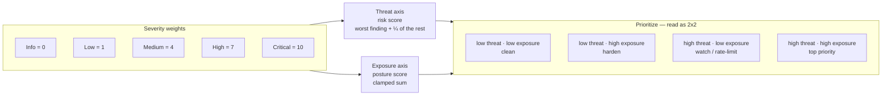

Every endpoint in the catalog is scored on **two independent axes**, not one. This is the model's core idea: *"is it being attacked?"* and *"is it vulnerable?"* are different questions, and collapsing them into a single number would let a storm of ordinary misconfiguration flags drown out one real attack — or vice versa.

## The two axes

| Axis | Lifetime field | Active field | Question | Nature |
|---|---|---|---|---|
| **Threat** | `max_risk_score` | `active_risk_score` | Is something dangerous happening? | An **event** — active attack / abuse |
| **Exposure** | `max_posture_score` | `active_posture_score` | How open / vulnerable is the endpoint standing still? | A **state** — config hygiene |

At a glance — severity weights feed the two independent axes, which combine as a 2x2 for prioritization:

```mermaid
flowchart LR
  subgraph Weights["Severity weights"]
    direction TB
    I["Info = 0"]
    L["Low = 1"]
    Md["Medium = 4"]
    H["High = 7"]
    Cr["Critical = 10"]
  end
  Weights --> TA["Threat axis<br/>risk score<br/>worst finding + ¼ of the rest"]
  Weights --> EA["Exposure axis<br/>posture score<br/>clamped sum"]
  TA --> Q
  EA --> Q
  subgraph Q["Prioritize — read as 2x2"]
    direction TB
    Q1["low threat · low exposure<br/>clean"]
    Q2["low threat · high exposure<br/>harden"]
    Q3["high threat · low exposure<br/>watch / rate-limit"]
    Q4["high threat · high exposure<br/>top priority"]
  end
```

Which axis a flag feeds is fixed per flag in the collector's severity catalog (`"posture": true` = Exposure), not derived from its class:

- **Threat** — the active findings: BOLA, BFLA, brute force, payment abuse, scanner UA / vuln probe / path scan, replay, rate and IP-rate anomalies, impossible travel, PII observed, oversized response, error-rate spike, unsafe method on a read-only path, threat-intel hit, and the derived `auth_inconsistent`.
- **Exposure** — the standing posture: `unauthenticated`, plain-text / weak TLS, missing HSTS / CSP / X-Frame-Options / X-Content-Type-Options, permissive CORS, the CORS-credential flags (`cors_credentials_wildcard`, derived `cors_origin_reflection`), `credential_in_query`, `basic_auth_plaintext`, the cookie flags, `weak_token_ttl`, `version_disclosure` and `error_status` — plus the info-tier context flags (`internal_host`, `external_host`, `legacy_protocol`, `sensitive_path_keyword`, `client_error_status`, `latency_anomaly`, `geo_change`, `unverified_proxy_tls`, derived `mixed_auth_schemes`), which score 0.

The UI renders the two axes in distinct colour families (Threat = red family, Exposure = blue/purple) so they never read as the same number. The per-flag axis, severity and class are listed in the [Risk Flags Reference](/api-discovery/risk-flags-reference).

## Severity weights

Each risk flag has a coarse 0–10 severity weight. Operators tune detector thresholds, not individual flag weights:

| Severity | Weight | Meaning |
|---|---|---|
| **Critical** | 10 | Exploitable now — no further pivot needed |
| **High** | 7 | High-confidence attack signal or hardened-posture failure |
| **Medium** | 4 | Suggestive state — normal in moderation, alert on clusters |
| **Low** | 1 | Ambient context |
| **Info** | 0 | Descriptive context, **not a finding** — shown, scored 0, excluded from "flagged" counts |

Per request the collector computes both axes:

- **Threat** is **max-anchored**: the worst threat severity plus the remaining threat severities divided by 4 (integer division), clamped to 255. A lone Critical outranks a pile of Mediums, and concurrent findings still add — gently.
- **Exposure** is the **clamped sum** of the posture severities (clamped to 255).

:::note[Ordinary backend errors don't inflate Threat]
A 5xx storm (`error_status`, Low) or a missing security header raises **Exposure**, never Threat. The top of a Threat-sorted list is real attack signal.
:::

The UI bands a score for badge colour: `0` none · `1–9` low · `10–24` medium · `25–39` high · `40+` critical.

## Lifetime vs active scores

The inventory keeps the **lifetime** maxima `max_risk_score` / `max_posture_score` (`$max`-merged — the worst request ever seen; derived flags are not part of them). Lifetime scores only rise, so on their own they cannot answer *"is it still bad?"*.

The backend therefore also reports an **active** score for every row, computed from the flags that are still **active**:

- A stored flag is active while its last sighting (`flag_last_seen.<flag>`) is inside the **active window** — `policy.risk_active_days` (default **7**, 1–90). The per-row cutoff is `max(now − risk_active_days, scores_reset_at)`, so a Reset or Rebaseline makes every earlier sighting historical at once.
- The active flags are re-scored with the collector's own scoring function (threat = max + Σrest/4, posture = sum), each axis clamped to the row's lifetime maximum.
- The severity of each **active derived flag** is added on top (`auth_inconsistent` → Threat; `mixed_auth_schemes` and `cors_origin_reflection` → Exposure), capped at 255. See [derived flags](/api-discovery/risk-flags-reference#active-historical-and-derived-flags).

The active score is what the product shows and sorts by: the endpoint list and attack-surface badges, the `min_risk_score` / `max_risk_score` filter, the New APIs / PII / Auth Coverage lists and the CSV export all use it. A row last seen before the active window scores **0**. Hovering a badge shows the lifetime max, and a green ↓ marks a row whose active score is below its lifetime peak — it was remediated or the attack stopped. The **Zombies** dashboard is the one exception: a zombie is silent, so its active score is almost always 0 and it ranks by **lifetime** scores instead.

### Current posture (ClickHouse window)

An endpoint's detail page also has a **current posture** panel computed from the raw ClickHouse events over the last `window_days` (default 7, max 7), bounded below by the row's last reset. It reports the current max threat/exposure, flags, PII categories, auth markers, event and shield-block counts, and whether the endpoint is **dormant** (no traffic in the window). When ClickHouse is unavailable the panel degrades to the lifetime values with an inline note.

## Security Score

The **Security Score** dashboard rolls one time window (default **1 hour**, max **7 days**) into a single **0–100** score with a letter grade — **A** ≥ 90, **B** ≥ 80, **C** ≥ 70, **D** ≥ 60, **F** below, **N/A** when it cannot be computed. It is built from five pillars:

| Pillar | Weight | Score (each term truncated, pillar clamped 0–100) | Minimum sample |
|---|---|---|---|
| **Auth coverage** | 0.30 | 100 − 100 × unauthenticated write ops / write ops | ≥ 5 write operations |
| **Transport security** | 0.25 | 100 − 100 × weak-transport events / total | ≥ 50 stored events |
| **Risk exposure** | 0.20 | 100 − 1.5 × p95 risk − 50 × critical events / total | ≥ 50 stored events |
| **Attack surface** | 0.15 | 100 − 50 × external ops / ops − 100 × sensitive ops / ops | ≥ 5 operations |
| **Threat activity** | 0.10 | 100 − 500 × threat-intel hits / total − 100 × scanner/bot events / total | ≥ 50 stored events |

The pillars count only **accepted anonymous** traffic as a gap — an event the upstream accepted without credentials *and* that raised the collector's `unauthenticated` finding (so mTLS, session-cookie, signed-URL and webhook-signature callers and monitors do not count). An authenticated public API is not attack surface, and health/info probes (`/health`, `/healthz`, `/livez`, `/readyz`, `/ping`, `/info`, …) are not counted as sensitive. Legacy HTTP/1.x is reported but weighs **0** in Transport security — it is not a security finding.

:::info[The insufficient-data gate]
A pillar whose sample is below its minimum is marked **insufficient data**: it gets grade N/A, shows its provisional score for reference, and is **excluded** — the overall score is the weighted mean of the remaining pillars with their weights renormalised. When every pillar is excluded, the score is empty (N/A) rather than a misleading number. A quiet window therefore never produces an A (or an F) from a handful of requests.
:::

See [Discovery Dashboards](/api-discovery/dashboards#security-score) for the dashboard itself.

## Flag classes

Independently of the axis, each flag carries a **class** — the dimension it belongs to. The Risk dashboard breaks findings down by class:

| Class | What it covers |
|---|---|
| `auth` | Missing, weak, or plaintext credentials |
| `attack_pattern` | Behavioural abuse — brute force, enumeration, scanning, replay, impossible travel |
| `transport` | Connection-layer and browser hygiene — plain HTTP, weak TLS, HSTS, CORS, cookies, legacy protocol |
| `data_leak` | Sensitive-data exposure — PII observed, credentials in the query, oversized responses |
| `discovery` | Contextual surface signals — internal vs external host, sensitive path keywords, version banners |
| `behavior` | Response-status and baseline signals — 4xx/5xx, latency / error-rate anomalies, geo change |
| `consistency` | The same endpoint behaving differently across events — `auth_inconsistent`, `mixed_auth_schemes` |

## How to prioritize

Read the two axes together as a 2×2:

| | **Low exposure** | **High exposure** |
|---|---|---|
| **Low threat** | ✅ Clean | 🔵 Boring but open → harden |
| **High threat** | 🔴 Solid but under attack | ⛔ Open & under attack — **top priority** |

- **High Threat + High Exposure** first — open *and* actively attacked.
- **High Exposure, Low Threat** — "boring but open": no attacker yet, but a standing weakness. Fix the hygiene (TLS, auth, headers) before it's found.
- **High Threat, Low Exposure** — a solid endpoint under attack; lean on rate limits / RBAC and watch it.

Sort the [endpoints view](/api-discovery/endpoints) by Threat to find what's under attack, by Exposure to find what to harden.

## Resetting scores (admin)

Admins/Owners have two levers, useful after a fix or a collector scoring change:

- **Rebaseline** (project-wide, from the [Listeners tab](/api-discovery/dashboards#listeners)) — sets `max_risk_score` and `max_posture_score` to 0 and stamps `scores_reset_at = now` on every endpoint, so every flag seen before the rebaseline becomes **historical**. It also clears the accepted-anonymous and anonymous-refusal markers, the stored `auth_inconsistent` / `unauthenticated` entries and the CORS-reflection evidence, so those findings are re-learned under the current rules. Discovery metadata (query-parameter names, TLS-proxy evidence) is kept.
- **Reset counters & risk** (single endpoint, from its detail page) — zeroes the endpoint's counters and scores, empties its flags, PII categories, endpoint categories, consumers and last-seen evidence, and stamps `scores_reset_at`.

Neither deletes the endpoint; the collector re-accumulates from the next event. For a windowed answer without resetting, use the **current posture** panel.

## Related

- [Risk Flags Reference](/api-discovery/risk-flags-reference) — every flag, severity, axis, OWASP mapping, remediation
- [Exploring Endpoints](/api-discovery/endpoints)
- [Discovery Dashboards](/api-discovery/dashboards)
