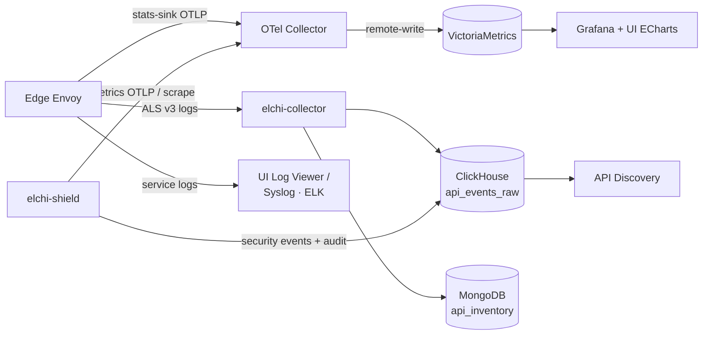

## The telemetry pipeline

Elchi emits several distinct signal classes, and each takes a different path to storage. Knowing which signal lands where saves a lot of dashboard-hunting.

- **Envoy stats** → an **OTel Collector** → **VictoriaMetrics** → **Grafana** (and the in-UI ECharts dashboards). The metrics backbone.
- **Envoy access logs (ALS v3)** → **elchi-collector** → **ClickHouse** (`api_events_raw`, forensic) + **MongoDB** (`api_inventory`, the endpoint catalog). This is [API Discovery](/api-discovery/overview) — a traffic-derived inventory, not a metrics stream.
- **Shield metrics** → scraped at `/metrics` (`elchi_shield_*`), and **also** pushed over **OTLP** when `--metrics-otlp-endpoint` is set. Shield **security events + audit** → **ClickHouse**. See [Shield Observability](/shield/observability).
- **Service logs** → the in-UI log viewer, and optionally forwarded by the client agent to **Syslog / Elastic-Logstash**.

### Signals → destinations

| Signal | Source | Transport | Lands in | Surfaced by |
|---|---|---|---|---|
| Envoy proxy stats | Edge Envoy | stats-sink → OTLP (`4317`/`4318`) | VictoriaMetrics (`8428`) | UI Metrics (ECharts) + Grafana (`3000`) |
| Envoy access logs | Edge Envoy | ALS v3 gRPC (`18090`) | ClickHouse `api_events_raw` + MongoDB `api_inventory` | [API Discovery](/api-discovery/overview) |
| Shield metrics | elchi-shield | `/metrics` scrape (`9001`) + optional OTLP push | Prometheus/VictoriaMetrics | [Shield Observability](/shield/observability) |
| Shield security events / audit | elchi-shield | direct write | ClickHouse (audit table, TTL'd) | Shield UI / [Audit](/observability/audit-and-syslog) |
| Collector metrics | elchi-collector | `/metrics` scrape (`18091`) | Prometheus/VictoriaMetrics | Grafana |
| Config-change audit | Controller | immutable trail | MongoDB | UI **Audit** + [syslog forwarding](/observability/audit-and-syslog) |
| Service logs | All services | stdout / agent export | Log viewer, Syslog, Elastic | UI **Observability → Logs** |

The OTLP endpoints (`4317`/`4318`), VictoriaMetrics (`8428`), Grafana (`3000`), ClickHouse, and the collector ports are all catalogued in the [Port Reference](/reference/ports).

## Metrics

Built-in dashboards (powered by ECharts) chart downstream, upstream, and listener metrics with custom time ranges, grouping, and auto-refresh. For deeper analysis, Elchi integrates Grafana so you can use full Grafana dashboards against the same VictoriaMetrics data. Open **Observability → Metrics**.

## Logs

The log viewer (**Observability → Logs**) streams service logs with JSON parsing, HTTP access-log detection, level filtering, and search. To centralize logs, the client agent can export to **Syslog** or **Elastic/Logstash**. For triage, [AI log analysis](/administration/ai-analysis) summarizes and explains log output when an OpenRouter token is configured.

## Endpoint discovery

Under **Discovery**, connected Kubernetes clusters report their services so Envoy clusters always see up-to-date upstreams. See [Elchi Discovery](/installation/discovery-agent/overview) to install the agent.
