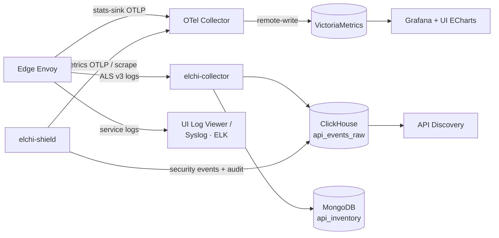

## The telemetry pipeline

Elchi emits several distinct signal classes, and each takes a different path to storage. Knowing which signal lands where saves a lot of dashboard-hunting.

```mermaid
flowchart LR
  E["Edge Envoy"]
  SH["elchi-shield"]
  E -->|stats-sink OTLP| OT["OTel Collector"]
  SH -->|metrics OTLP / scrape| OT
  OT -->|remote-write| VM[("VictoriaMetrics")]
  VM --> G["Grafana + UI ECharts"]
  E -->|ALS v3 logs| COL["elchi-collector"]
  COL --> CH[("ClickHouse<br/>api_events_raw")]
  COL --> MG[("MongoDB<br/>api_inventory")]
  CH --> AD["API Discovery"]
  SH -->|security events + audit| CH
  E -->|service logs| LV["UI Log Viewer /<br/>Syslog · ELK"]
```

- **Envoy stats** → an **OTel Collector** → **VictoriaMetrics** → **Grafana** (and the in-UI ECharts dashboards). The metrics backbone.
- **Envoy access logs (ALS v3)** → **elchi-collector** → **ClickHouse** (`api_events_raw`, forensic) + **MongoDB** (`api_inventory`, the endpoint catalog). This is [API Discovery](/api-discovery/overview) — a traffic-derived inventory, not a metrics stream.
- **Shield metrics** → scraped at `/metrics` (`elchi_shield_*`), and **also** pushed over **OTLP** when `--metrics-otlp-endpoint` is set. Shield **security events + audit** → **ClickHouse**. See [Shield Observability](/shield/observability).
- **Service logs** → the in-UI log viewer, and optionally forwarded by the client agent to **Syslog / Elastic-Logstash**.

### Signals → destinations

| Signal | Source | Transport | Lands in | Surfaced by |
|---|---|---|---|---|
| Envoy proxy stats | Edge Envoy | stats-sink → OTLP (`4317`/`4318`) | VictoriaMetrics (`8428`) | UI Metrics (ECharts) + Grafana (`3000`) |
| Envoy access logs | Edge Envoy | ALS v3 gRPC (`18090`) | ClickHouse `api_events_raw` + MongoDB `api_inventory` | [API Discovery](/api-discovery/overview) |
| Shield metrics | elchi-shield | `/metrics` scrape (`9001`) + optional OTLP push | Prometheus/VictoriaMetrics | [Shield Observability](/shield/observability) |
| Shield security events / audit | elchi-shield | direct write | ClickHouse (audit table, TTL'd) | Shield UI / [Audit](/observability/audit-and-syslog) |
| Collector metrics | elchi-collector | `/metrics` scrape (`18091`) | Prometheus/VictoriaMetrics | Grafana |
| Config-change audit | Controller | immutable trail | MongoDB | UI **Audit** + [syslog forwarding](/observability/audit-and-syslog) |
| Service logs | All services | stdout / agent export | Log viewer, Syslog, Elastic | UI **Observability → Logs** |

The OTLP endpoints (`4317`/`4318`), VictoriaMetrics (`8428`), Grafana (`3000`), ClickHouse, and the collector ports are all catalogued in the [Architecture](/getting-started/architecture) connection table.

## Metrics

**Observability → Metrics** is a service dashboard for one listener. For deeper analysis, Elchi also
integrates Grafana against the same VictoriaMetrics data.

| Area | What it does |
|---|---|
| **Summary** | Always on top for the selected range: request rate, 5xx and 4xx share, latency at the chosen percentile, open connections, healthy / total upstream hosts and — when the listener runs Shield (or another ext_proc filter) — the share of requests it blocked (links to Shield → Events). Each stat has a sparkline; the 5xx and 4xx stats open those requests in [Logs](/observability/service-logs). With a comparison on, each stat also shows its change against the earlier period. |
| **Upstream clusters** | One row per upstream cluster over the range, worst first: request rate, 5xx share, latency at the chosen percentile, healthy / total hosts, open connections, retries. Click a row to filter the page by that cluster. A cluster that only carries a long-lived gRPC stream (such as Shield's ext_proc) has no request latency. |
| **Changes** | Deploys and other agent commands on the service, and published config changes of the resources the listener uses (from the audit trail), are drawn as vertical markers on every chart — purple for the service, orange for config — with what changed and who on hover. **Changes** lists them; clicking one zooms to the 15 minutes around it. Saved-only edits are not shown: they do not reach Envoy. |
| **Distributions** | *Downstream Request Duration Distribution* and *Upstream Response Time Distribution* are heatmaps: every request of a step placed in its duration bucket. Two bands mean two populations (blocked vs proxied requests, cache hits vs misses, one slow backend) that a single percentile line hides. |
| **External processing** | For Shield or any ext_proc filter: requests sent to the processor, requests it answered itself (for Shield, the blocks), that share, processor problems (failed streams, timeouts, fail-open) and messages exchanged. |
| **Explore** | **Dashboard / Explore** in the toolbar. Explore lists every stat the listener reports, grouped by family and marked counter, gauge or histogram; click one to add a chart — up to eight, one under another, sharing the time range, the crosshair (hover one, see the same moment on all) and the change markers so they can be compared; each is charted with the right math (a counter as a rate, a gauge summed / maxed / averaged, a histogram as a percentile or a heatmap), split by any of its labels. **Edit query** shows the MetricsQL and runs your own (as written — the page's filters are not added). **Pin to dashboard** keeps the chart in a *Pinned* section at the top of the dashboard (in this browser). |
| **Data freshness** | When a client stops sending metrics (agent, Envoy or the telemetry pipeline down), a banner names it and how long ago its last sample arrived, and the charts hatch the time without data — so a gap is not mistaken for zero traffic. For a past range it is judged against the end of the range. |
| **Sections** | Upstream health, downstream requests and connections, upstream requests and connections, listener, and one section per filter (RBAC, local rate limit, compressor …). A filter section is hidden while the listener reports none of its metrics (**Show all** lists them). Sections open or collapse, and the choice is remembered. |
| **Toolbar** | Service, metric group (all / errors / upstream clusters / filters), upstream cluster filter, client filter and **Split by client** (one line per agent, shown when the service runs on more than one client), percentile (p50 / p90 / p95 / p99, p95 by default), **compare** with 1 hour / 1 day / 1 week ago, time range (5 minutes … 7 days, or an absolute range) with **Back** and **Zoom out (×2)**, auto refresh (5 s … 5 min), **Logs** for the same range. Times are in the browser's zone, shown next to the range. |
| **Charts** | Counters are plotted as a rate; slow traffic switches the unit to per minute or per hour (`18/h` rather than `0.005/s`). Gauges are plotted as they are. Missing samples leave a gap. Hovering a chart shows the same moment on every chart (shared crosshair). A comparison draws the earlier period dashed in the same colour. Drag across a chart to zoom the whole page into that range. Each chart opens fullscreen and downloads as CSV or PNG; **Copy query** gives its MetricsQL. |
| **Link** | The service, range, group, clusters, percentile and refresh are in the page URL, so a view can be shared or bookmarked. |

Each section header shows how many of its panels have data (for example *6/9 with data*), and **Hide
panels without data** leaves only those. An empty chart says why: **None recorded** — Envoy exports a
counter only once it has counted something, so an error counter that never fired has no series (no
errors); **Not reported** — the listener does not report that metric (the feature is not in use); **No
data in this range** — the metric exists but had no value in the range or for the filters. A failed query
shows its error and a **Retry** in place.

## Logs

The log viewer (**Observability → Logs**) searches a listener's Envoy and access logs on the proxy hosts by time range, with a histogram, field filters and exact paging — see [Service Logs](/observability/service-logs). To centralize logs, the client agent can export to **Syslog** or **Elastic/Logstash**. For triage, [AI log analysis](/administration/ai-analysis) summarizes and explains log output when an OpenRouter token is configured.

## Endpoint discovery

Under **Discovery**, connected Kubernetes clusters report their services so Envoy clusters always see up-to-date upstreams. See [Elchi Discovery](/installation/discovery-agent/overview) to install the agent.
