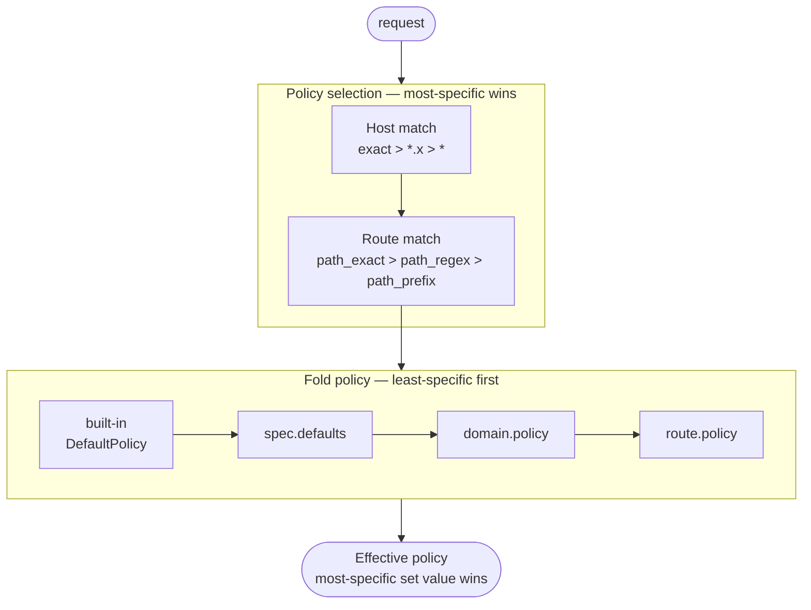

Elchi Shield is configured entirely through **policy files** written into a watched
directory on each edge node. Every file is a `SecurityPolicy` document; the service
merges all files into one immutable runtime snapshot and hot-reloads it atomically
on every change. This page covers the document structure end to end: the envelope,
`spec`, domains, routes, match predicates, the inheritance model, and how multiple
files merge.

For how the files get onto the node and how Envoy is pointed at Shield, see
[Deployment](/shield/deployment) and [Envoy wiring](/shield/envoy-wiring). For the
enforcement semantics of the resolved policy, see
[Modes & Fail Postures](/shield/policies/modes-and-postures).

## File envelope

Every file uses a Kubernetes-style envelope so it is versionable and familiar.
Decoding is **strict**: unknown fields are rejected, and any envelope mismatch
rejects the whole file (the previous valid snapshot stays active).

| Option | Type | Default | Description |
|---|---|---|---|
| `apiVersion` | string | **required** | Must be `sentinel.elchi.io/v1`. Any other value rejects the file. |
| `kind` | string | **required** | Must be `SecurityPolicy`. |
| `metadata.name` | string | — | Human label for the document (diagnostics only). |
| `metadata.labels` | map[string]string | — | Operator labels (informational; not used for selection). |
| `spec` | object | **required** | The policy body. |

```yaml
apiVersion: sentinel.elchi.io/v1
kind: SecurityPolicy
metadata:
  name: public-api
spec:
  defaults:
    mode: block
  domains: []        # add domains + routes here
```

## `spec`

| Option | Type | Default | Description |
|---|---|---|---|
| `defaults` | `PolicySpec` | built-in `DefaultPolicy` | File-level policy defaults applied beneath every domain/route in this file. |
| `domains` | `Domain[]` | empty | Host-scoped route sets. |
| `exclude` | string[] | empty | Request paths that bypass **all** inspection. |

A file with no `domains` is valid — for example, a file that only contributes
`exclude` paths and is merged with other files. Hosts not matched by any domain
fall through to the request being **allowed** (no policy means pass-through; the
inspection posture only applies to matched hosts).

## `spec.exclude` — paths that bypass everything

A list of request **paths** that bypass *all* inspection, checked **before**
policy resolution as a cheap, shared pass-through. Use it for health checks,
metrics scrapes, or static assets that never need a WAF decision.

| Property | Behavior |
|---|---|
| Match type | **Exact** path match (not prefix). |
| Query string | **Ignored** (stripped before matching). |
| Normalization | Path is percent-decoded once, dot-segments (`/./`, `/../`) and duplicate slashes collapsed, then compared — the same normalization used for route matching, so an attacker cannot dodge it with `%2e` or `//`. |
| Validation | Each entry must be a **non-empty absolute path** (start with `/`). |
| Case | Case-sensitive (HTTP path convention). |
| Posture | Applies regardless of the default mode — an excluded path is always a `continue`. |

:::warning
An excluded path skips **every** check — WAF, auth, rate limiting, DLP, all of it,
in both directions. Keep the list minimal and exact. If you only want to relax
inspection on a route, prefer a route with `mode: off` or a targeted
`skip_checks` instead (see [Built-in Checks](/shield/policies/checks)).
:::

```yaml
spec:
  exclude:
    - /healthz
    - /metrics
    - /favicon.ico
```

## `Domain`

A domain scopes a set of routes to one or more hosts.

| Option | Type | Default | Description |
|---|---|---|---|
| `hosts` | string[] | **required** (≥1) | The request authorities this domain matches. |
| `policy` | `PolicySpec` | inherits file defaults | Domain-level override applied above file defaults, below each route. |
| `routes` | `Route[]` | empty | Routes evaluated by match precedence. |

### `hosts` entries and precedence

Each entry is one of:

| Form | Example | Matches | Specificity |
|---|---|---|---|
| Exact host | `api.example.com` | only that host | highest |
| Leading wildcard | `*.example.com` | any single- or multi-label subdomain | by suffix length |
| Catch-all | `*` | any host | lowest |

- The domain matches if **any** entry matches.
- When multiple domains could match a host, the **most-specific matching entry
  wins**: exact > `*.x` (a longer suffix beats a shorter one) > `*`.
- Host matching is on the **canonical** authority: userinfo and port stripped,
  trailing dot removed, lower-cased. A `Host` header disagreeing with
  `:authority` is a host-smuggling signal and is **rejected unconditionally** —
  this is a structural integrity gate that runs regardless of the resolved policy's
  mode (even `off` / excluded paths), so it can't be dodged by targeting a permissive
  authority.
- Validation: an entry must be `*` or match `^(\*\.)?label(\.label)*$`
  (alphanumerics, `_`, `-`). No port, `@`, or scheme is allowed.

```yaml
domains:
  - hosts: ["api.example.com", "*.api.example.com"]
    policy: { mode: block }
    routes: [ ... ]
  - hosts: ["*"]            # catch-all fallback for any other host
    policy: { mode: detect }
```

## `Route` and `Match`

A route binds a **match predicate** to a **policy override**.

| Option | Type | Default | Description |
|---|---|---|---|
| `match` | `Match` | empty (matches everything) | Predicate selecting requests. An **empty match matches every request** to the domain — the domain default route. |
| `policy` | `PolicySpec` | — | Policy override for matched requests. |

Within a domain, routes are selected by **path-match precedence**:
`path_exact` > `path_regex` > `path_prefix`. Two routes with identical predicates
in one domain is a validation error (duplicate route).

### `Match` fields

| Option | Type | Default | Description |
|---|---|---|---|
| `path_exact` | string | — | Match the exact normalized path. |
| `path_prefix` | string | — | Match paths under this prefix. |
| `path_regex` | string (RE2) | — | Match paths by regex (must compile at load). |
| `methods` | string[] | any | `GET HEAD POST PUT PATCH DELETE CONNECT OPTIONS TRACE` (case-insensitive). Empty = any. |
| `content_type` | string[] | any | Restrict to these `Content-Type` media types. Empty = any. |
| `headers` | `HeaderMatch[]` | — | Additional header predicates (**all** must match). |

:::note
Set **at most one** of `path_exact` / `path_prefix` / `path_regex`. Paths are
matched on the normalized form (percent-decoded, dot-segments collapsed), so
`/admin/%2e%2e/secret` cannot slip past a `/admin` prefix rule.
:::

### `HeaderMatch`

Matches a single request header. Set **at most one** of
`exact` / `contains` / `regex` / `present`.

| Option | Type | Default | Description |
|---|---|---|---|
| `name` | string | **required** | Header name (case-insensitive). |
| `exact` | string | — | Exact value match. |
| `contains` | string | — | Substring match. |
| `regex` | string (RE2) | — | Regex match (must compile). |
| `present` | bool | — | `true` = header must be present; `false` = must be absent. |

## `PolicySpec` — the tunable fields

`PolicySpec` is the policy block used at all three scopes (`spec.defaults`,
`domain.policy`, `route.policy`). Every field is optional at every scope; the
full set:

| Option | Type | Default (built-in) | Description |
|---|---|---|---|
| `mode` | enum | `block` | `block` \| `detect` \| `shadow` \| `off` — enforcement posture. See [Modes & Fail Postures](/shield/policies/modes-and-postures). |
| `fail_mode` | enum | `fail_open` | `fail_open` \| `fail_close` — behavior when an engine errors or times out. |
| `inspect_request_body` | bool | `false` | Buffer & inspect the request body. |
| `inspect_response_body` | bool | `false` | Buffer & inspect the response body. |
| `max_request_body_bytes` | int64 | `1048576` (1 MiB) | Per-request body buffer cap. Range `0`–`1073741824` (1 GiB); `0` = do not inspect. Over-limit ⇒ **block** (non-skippable). |
| `max_response_body_bytes` | int64 | `0` (no inspect) | Per-response body buffer cap. Same range and semantics. |
| `max_header_bytes` | int64 | `8192` (8 KiB) | Default per-header-value size cap when a route's `checks` doesn't set a tighter one. `≥ 0`. |
| `timeout` | duration | `50ms` | Per-request inspection deadline (context deadline). Must be `> 0` if set. |
| `log_level` | string | `info` | `debug` \| `info` \| `warn` \| `warning` \| `error` — per-policy log verbosity. |
| `sampling_rate` | float | `0.05` | Fraction of **allow** decisions audited, range `[0, 1]` (blocks/detections always audited). Default samples 5% of the allow stream. |
| `anomaly_threshold` | int | `0` (disabled) | Block when summed engine anomaly scores reach this. `0` disables. |
| `skip_checks` | string[] | empty | Exempt named built-in checks. **Union** across scopes. See [Built-in Checks](/shield/policies/checks). |
| `pipeline` | `PipelineSpec` | default order | Reorder/disable inspector stages (below). |
| `checks` | `Checks` | none | Built-in header/body checks. See [Built-in Checks](/shield/policies/checks). |
| `engines` | `EnginesSpec` | none | Pluggable security engines (JWT, Coraza, rate limit, …). |

:::note[Cross-field validation]
Enforced at load time, attributed to file + field:

- `mode: off` with `inspect_request_body: true` or `inspect_response_body: true`
  is rejected — inspecting a body while off can never do anything.
- `inspect_request_body: true` with `max_request_body_bytes: 0` is rejected
  (enabled but no budget). The same rule applies to the response pair.
:::

The deep dives: [Modes & Fail Postures](/shield/policies/modes-and-postures)
for `mode`/`fail_mode`, [Body Inspection & Limits](/shield/policies/body-inspection)
for the body toggles and caps, [Built-in Checks](/shield/policies/checks) for
`checks`/`skip_checks`/`pipeline`, and [DLP](/shield/policies/dlp) for
`checks.body.dlp`.

## Inheritance: how the effective policy is resolved

`PolicySpec` is a **sparse** block used at three scopes — `spec.defaults`,
`domain.policy`, `route.policy`. Only fields that are actually **set** override
the inherited value; an omitted field inherits, while a present field (even a
zero like `0` or `false`) overrides. This is why `max_request_body_bytes: 0`
means "do not inspect", not "no limit".

For a matched request, the effective policy is folded **least-specific first**:

```
built-in DefaultPolicy  →  spec.defaults  →  domain.policy  →  route.policy
```

At a glance — first the host and route are matched (most-specific wins), then the policy is folded least-specific first:



| Field class | Merge behavior |
|---|---|
| Scalar fields (`mode`, `timeout`, `fail_mode`, size caps, …) | The **most-specific set value wins**. |
| `skip_checks` | **Union** across all scopes — a broad scope can exempt, a narrow scope can add more. |
| `pipeline.request` / `pipeline.response` | **Replace wholesale** per direction when set. |
| `checks.headers` / `checks.body` | Each sub-block **replaces** when set. |
| `engines` | **Replaces wholesale** when set — a narrower scope's `engines` block fully supersedes the inherited one; it is **not** deep-merged. |

:::warning
The `engines` wholesale-replace rule is the most common surprise: if
`spec.defaults` configures `coraza` and a route sets `engines: { rate_limit: ... }`,
that route runs **only** the rate limiter — the WAF is gone for that route. Repeat
the full engine set at the scope where you override it.
:::

The full `PolicySpec` field reference (modes, fail postures, body limits, checks,
engines) is split across [Modes & Fail Postures](/shield/policies/modes-and-postures),
[Body Inspection & Limits](/shield/policies/body-inspection),
[Built-in Checks](/shield/policies/checks), and the per-engine pages under
Engines (for example [Coraza WAF](/shield/engines/coraza-waf)).

## `pipeline` — inspector stage order

`policy.pipeline` reorders (and, by omission, disables) the **reorderable
inspector stages**, per direction. The structural stages (context init, policy
resolve, early decision, body-truncation guard, content-decode, body gate) are
always present at fixed positions and are not listed here.

| Option | Type | Description |
|---|---|---|
| `request` | string[] | Inspector order for the request pipeline. |
| `response` | string[] | Inspector order for the response pipeline. |

Valid stage names (no duplicates):

| Stage | Phase | Contains |
|---|---|---|
| `fast_pre_checks` | header | host / forbidden / required / oversized-header checks |
| `body_checks` | body | `require_json`, `detect_sensitive_data`, DLP |
| `waf_engine` | header **and** body | header-phase engines (JWT, API key, IP reputation, bot, XFCC, …) at header time + body engines (Coraza, GraphQL, OpenAPI) at body time |

- **Omitting a stage disables it** for that direction.
- Default order when unset: `fast_pre_checks` → `body_checks` → `waf_engine`.
- Cross-phase position is normalized (header-phase inspectors always run at
  header time, body-phase at body time); **ordering within a phase is honored
  exactly** — listing `waf_engine` before `body_checks` runs the WAF engines
  first.

```yaml
policy:
  pipeline:
    request:  [fast_pre_checks, waf_engine, body_checks]
    response: [body_checks]      # only DLP/body checks on the response
```

See [Built-in Checks & Pipeline Order](/shield/policies/checks) for the
wholesale-replace semantics and worked examples.

## Multi-file behavior and merge

The service watches a directory; multiple YAML/JSON files are read and merged
into one runtime snapshot on every (debounced) change.

- Files are processed in **sorted filename order**; one file may contain multiple
  domains, and one domain may contain multiple routes.
- **Hosts are globally unique** across all files. The same host (case-insensitive,
  whitespace-trimmed) declared in two domains — in the same or different files —
  is a validation error (ambiguous resolution), attributed to the file.
- **`exclude` is a union** across all files, deduplicated.
- **Reload is atomic and fail-safe.** If the merged result fails validation, the
  current snapshot stays active and a reload-failure metric/log is emitted with
  the attributed file + field. The last valid config is reloaded from disk on
  restart.

:::tip
Because hosts are globally unique, a natural layout is one file per application
domain (`api-payments.yaml`, `api-public.yaml`, …) plus one shared file that only
carries `spec.exclude` entries. Validation errors always name the offending file
and field — check the reload metrics described in
[Observability](/shield/observability) after every push.
:::

## Full annotated example

```yaml
apiVersion: sentinel.elchi.io/v1          # required, exactly this value
kind: SecurityPolicy                       # required, exactly this value
metadata:
  name: api-public                         # diagnostics label only
  labels:
    team: platform
    env: prod

spec:
  # Paths that bypass ALL inspection, before any policy resolution.
  exclude:
    - /healthz
    - /metrics

  # File-level defaults inherited by every domain/route below unless overridden.
  defaults:
    mode: block            # block | detect | shadow | off
    fail_mode: fail_open   # fail_open | fail_close (engine errors only)
    max_request_body_bytes: 1048576   # 1 MiB
    max_response_body_bytes: 0        # 0 = do not inspect responses
    max_header_bytes: 8192
    timeout: 50ms
    log_level: info
    sampling_rate: 1.0

  domains:
    - hosts: ["api.example.com"]           # exact host — highest specificity
      routes:
        # Inspect JSON request bodies on the v1 API surface.
        - match:
            path_prefix: "/v1/"
            methods: [GET, POST, PUT, PATCH, DELETE]
          policy:
            mode: block
            inspect_request_body: true
            max_request_body_bytes: 524288
            checks:
              headers:
                required: ["X-Request-Id"]
                forbidden: ["X-Debug"]
                enforce_valid_host: true
                max_header_value_bytes: 4096
              body:
                require_json: true
                detect_sensitive_data: true

        # Admin surface: monitor only (detect), fail closed on engine errors.
        - match:
            path_regex: "^/admin/.*$"      # RE2; path_exact > path_regex > path_prefix
          policy:
            mode: detect
            fail_mode: fail_close

        # Health probe route inside a domain: skip inspection for this route only.
        - match:
            path_exact: "/status"
            methods: [GET]
          policy:
            mode: off

    # A second domain in the same file — wildcard host, shadow posture.
    - hosts: ["*.internal.example.com"]    # wildcard — beats "*" but loses to exact
      policy:
        mode: shadow
        sampling_rate: 0.25
```

## Next steps

- [Modes & Fail Postures](/shield/policies/modes-and-postures) — what
  `block`/`detect`/`shadow`/`off` and `fail_open`/`fail_close` actually do.
- [Body Inspection & Limits](/shield/policies/body-inspection) — buffering,
  size caps, and the always-on structural protections.
- [Built-in Checks & Pipeline Order](/shield/policies/checks) — header/body
  checks, `skip_checks`, and stage ordering.
- Author policies visually in the [Policy Editor](/shield/ui/policy-editor).
