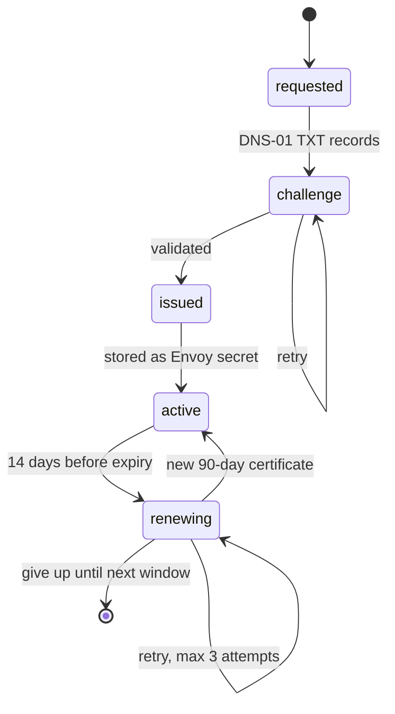

This page covers the certificate lifecycle after creation: completing DNS challenges, renewing, changing the DNS credential, the auto-renewal cadence, and getting a stuck certificate moving again.

## Certificate statuses

A certificate moves through these states:

| Status | Meaning |
| --- | --- |
| `pending_dns` | Manual mode: ACME order created, waiting for you to add TXT records and verify. |
| `pending_verification` | Automatic mode: background verification job queued/running. |
| `verifying` | Verification in progress. |
| `active` | Issued and stored as Envoy secret(s). |
| `verification_failed` | A validation attempt failed; can be retried. |
| `renewal_pending` | A renewal job is queued/running. |
| `renewal_failed` | A renewal attempt failed; can be retried. |
| `expired` | Past `expires_at`; the scheduler marks active certs expired. |

## Completing DNS challenges (manual mode)

If a certificate was created **without** a DNS credential, you complete the challenge yourself.

**1. Fetch the real TXT records.** Elchi creates the ACME order on demand and returns the record name and value:

```bash
GET /api/v3/acme/certificates/{cert_id}/dns-challenges?project=<project-id>
```

The response lists each domain's `fqdn` (e.g. `_acme-challenge.example.com`), `type` (`TXT`), and `value`. Add `refresh=true` to discard a stale order and generate fresh challenge values.

**2. Add the TXT records** to your DNS zone exactly as returned. You have up to **24 hours** to do this before the challenge expires.

**3. Verify.** Once the records are live and have propagated:

```bash
POST /api/v3/acme/certificates/{cert_id}/verify?project=<project-id>
```

Elchi asks the CA to validate the existing order and, on success, downloads the certificate and stores it as Envoy secret(s); the certificate becomes `active`. Verifying requires **Editor+**.

:::tip
After adding TXT records, wait a few minutes for propagation before verifying. If verification fails but the records are correct, wait 5–10 minutes and retry. If it keeps failing for an hour, re-fetch with `refresh=true` to get new challenge values (the old order may have gone stale).
:::

## Retrying automatic verification

For **automatic** (DNS-credential) certificates stuck in `pending_verification` or `verification_failed`, re-run the background job:

```bash
POST /api/v3/acme/certificates/{cert_id}/retry-verification?project=<project-id>
```

This refreshes the temporary issuance key and enqueues a fresh verification job. It only applies to certificates created with automatic DNS — for manual certificates use the verify endpoint above. Requires **Editor+**.

## Renewing

```bash
POST /api/v3/acme/certificates/{cert_id}/renew?project=<project-id>
```

Renewal is allowed for certificates that are `active`, `renewal_failed`, `expired`, or `verification_failed` **provided they were previously issued** (they have at least one secret version). Manual renewal requires **Admin/Owner**.

- **Automatic DNS** — renewal runs as a background job: the certificate moves to `renewal_pending`, Elchi generates a new key, republishes the TXT records via the stored DNS credential, obtains a new certificate, and writes it to **all** of the certificate's versions. A new 90-day validity and a fresh renewal window are set.
- **Manual DNS** — renewal is synchronous and creates **new** challenges: the certificate returns to `pending_dns` with fresh TXT records for you to add, then you call **Verify** again.

## Changing the DNS credential

If you rotate providers or a credential is deprecated, repoint a certificate at a different DNS credential without recreating it:

```bash
PUT /api/v3/acme/certificates/{cert_id}/dns-credential?project=<project-id>
Content-Type: application/json

{ "dns_credential_id": "<new credential id>" }
```

The new credential must be **active** and you must have permission to use it. This only applies to certificates using automatic DNS — you cannot attach a credential to a `manual` certificate this way. Changing the credential is restricted to **Admin/Owner**. Use this to recover an [orphaned certificate](/traffic-and-certificates/acme/dns-credentials#deleting-a-credential) whose credential was force-deleted.

## Auto-renewal cadence

A renewal scheduler on the controller handles renewals without intervention:

- It runs a check **immediately on startup**, then **every 24 hours**.
- A certificate becomes eligible when its renewal window opens — **14 days before expiry** (certificates use 90-day validity, so eligibility begins with ~2 weeks of runway).
- Eligible certificates are renewed via a background job using their stored DNS credential and ACME account.
- Active certificates past their expiry are marked `expired` during the same pass.
- The scheduler retries a failing certificate up to **3 renewal attempts** before giving up until the next window; a successful renewal resets the counter.
- A distributed lock coordinates the scheduler so that running multiple controllers does not double-renew a certificate.

At a glance — the certificate lifecycle, from request through the recurring renewal window:



:::warning[Manual DNS certificates are not auto-renewed]
The scheduler skips certificates that use **manual** DNS verification, because renewing them requires a human to place new TXT records. Renew manual certificates yourself (via the renew endpoint, which regenerates the challenges) well before expiry, or migrate them to a DNS credential for hands-off renewal.
:::

## Troubleshooting a stuck verification

| Symptom | Likely cause & fix |
| --- | --- |
| Stuck in `pending_verification`, then `verification_failed` | The automatic job timed out. Automatic verification has a **5-minute** budget; slow DNS propagation blows it. Confirm the credential works (test it), then **retry-verification**. |
| `verification_failed` in manual mode | TXT records missing, wrong, or not yet propagated. Re-fetch with `refresh=true`, re-add the records, wait for propagation, then **Verify**. |
| Rate-limit error from the CA | Too many failed authorizations for the domain in the last hour, or a production weekly limit. Wait an hour (or switch to `staging` while debugging), or use a different subdomain. |
| DNS credential test fails | Wrong token/permissions or wrong zone. Fix the token scope (e.g. Cloudflare `Zone:DNS:Edit`) and re-test before issuing. See [DNS credentials](/traffic-and-certificates/acme/dns-credentials). |
| Renewal fails, `renewal_failed` | Credential or account no longer valid, or DNS unreachable. Verify the account is registered and the credential tests clean, then **renew** again (the scheduler also retries up to 3 times). |
| Certificate marked "orphaned" | Its ACME account was deleted. Renewal cannot proceed until you attach a valid account. |
| Split-horizon / SERVFAIL during DNS check | The authoritative nameserver resolves to an internal address the controller cannot reach. For Google Cloud DNS, set the `zone_id` on the credential to bypass the SOA lookup. |

:::note
Certificate responses have their external ACME URLs stripped, so firewalls or WAFs that block CA domains do not interfere with the UI. If issuance fails outright, confirm the controller has outbound access to both the CA's ACME directory and your DNS provider's API.
:::
