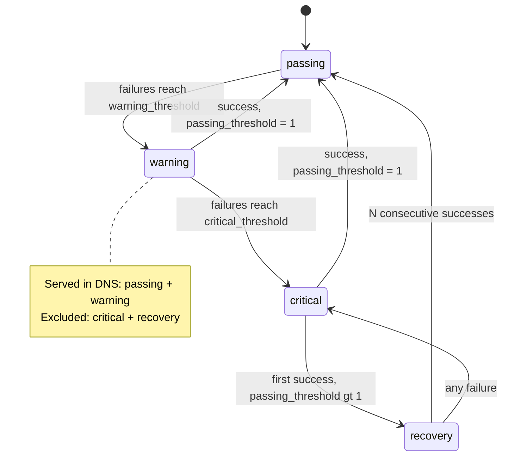

GSLB continuously probes every IP behind a record and drives each one through a **quad-state health model**. Only healthy states appear in DNS answers, so the model is what makes GSLB answers reflect reality. This page covers the probe configuration, the states and transitions, and how state maps to DNS inclusion.

## Probe types

A record's `probe` object defines its health check. Three probe types are supported:

| Type | What it does | Success criteria |
| --- | --- | --- |
| `http` | HTTP GET to `path` on `port` | Response status matches `expected_status_codes`. |
| `https` | HTTPS GET (TLS) to `path` on `port` | As HTTP, plus TLS handshake. Optional `skip_ssl_verify` for self-signed certs. |
| `tcp` | TCP connect to `port` | Connection establishes successfully. |

### Probe configuration

| Field | Applies to | Notes |
| --- | --- | --- |
| `type` | all | `http`, `https`, or `tcp`. |
| `port` | all | Target port. |
| `path` | http/https | Request path (default `/`). |
| `host_header` | http/https | Explicit `Host` header for the probe. |
| `interval` | all | Seconds between probes: one of `10`, `20`, `30`, `60`, `90`, `120`, `180`, `300`. |
| `timeout` | all | Probe timeout, `0.1`–`3.0` seconds. |
| `enabled` | all | `false` pauses probing without deleting the config. |
| `warning_threshold` | all | Consecutive failures before `warning`. |
| `critical_threshold` | all | Consecutive failures before `critical`. |
| `passing_threshold` | all | Consecutive successes required to fully recover (default `1`, max `10`). Values `> 1` enable the anti-flapping `recovery` state. |
| `expected_status_codes` | http/https | Accepted status ranges, e.g. `["200-299", "301"]`. Default `["200-399"]`. |
| `follow_redirects` | http/https | Follow HTTP redirects (default `true`). |
| `skip_ssl_verify` | https | Skip TLS certificate verification (default `false`). |

Pausing a probe (`enabled: false`) keeps the configuration and the last known health state but stops issuing checks — useful for planned maintenance where you don't want probe noise. To stop checking and drop the config entirely, send `probe: null` on a record update.

## Health states

Each IP is always in exactly one of four states:

| State | Meaning | In DNS answers? |
| --- | --- | --- |
| `passing` | Healthy — no consecutive failures. | ✅ Yes |
| `warning` | Degraded — failing but not yet evicted. Probed more aggressively. | ✅ Yes |
| `critical` | Unhealthy — evicted from DNS. Circuit breaker active. | ❌ No |
| `recovery` | Coming back — succeeding again but held until stable (only when `passing_threshold > 1`). | ❌ No |

The rule that matters for traffic: **`passing` and `warning` IPs are served; `critical` and `recovery` IPs are excluded.** `warning` is deliberately still served — it is an early-warning signal, not an eviction. Eviction happens only at `critical`.

At a glance — probe results walk each IP through the four states, and only two are served in DNS:



## State transitions

### Failure path

```text
passing ──(failures ≥ warning_threshold)──► warning ──(failures ≥ critical_threshold)──► critical
```

Consecutive probe failures walk an IP down: `passing → warning` once failures reach `warning_threshold`, then `warning → critical` once they reach `critical_threshold`.

### Recovery path

Recovery depends on `passing_threshold`:

**Default (`passing_threshold = 1`)** — direct recovery. A single successful probe returns a `warning` or `critical` IP straight to `passing`.

**Anti-flapping mode (`passing_threshold > 1`)** — recovery is gated through the `recovery` state:

```text
critical/warning ──(first success)──► recovery ──(passing_threshold consecutive successes)──► passing
       ▲                                  │
       └──────────(any failure)───────────┘
```

A recovering IP must string together `passing_threshold` consecutive successes before it is trusted back into DNS. A single failure during `recovery` drops it back to `critical` and resets the recovery counter. This prevents an unstable endpoint from flapping in and out of rotation.

Example with `warning_threshold=1`, `critical_threshold=3`, `passing_threshold=2`:

```text
critical + success → recovery (1/2 successes)   ← still excluded from DNS
recovery + success → passing  (2/2 successes)   ← back in DNS
recovery + failure → critical (reset)
```

### Manual overrides

An operator can force a state via `PUT /api/v3/gslb/:id/ips/:ip` (see [Records & IPs](/traffic-and-certificates/gslb/records-and-ips)). The override sets a `manual_reset_at` timestamp and resets the failure counter, so the next probe establishes a fresh baseline. Overrides are not sticky: the health checker keeps probing and will move the IP again on real results. Forcing `passing` on a genuinely-down endpoint simply flips back to `critical` on the next failed probe.

## Probe scheduling and the circuit breaker

State also governs how *often* an IP is probed:

| State | Next probe |
| --- | --- |
| `passing` | Normal `interval`. |
| `warning` | `interval / 2` — increased monitoring for faster failover detection. |
| `recovery` | `interval / 2` — faster verification while recovering. |
| `critical` | Graduated backoff (circuit breaker). |

For `critical` IPs, a **circuit breaker** applies exponential backoff so Elchi stops hammering a persistently-dead endpoint while still checking often enough to detect recovery quickly. Backoff scales with the probe interval using multipliers and is capped at **300 seconds (5 minutes)**:

```text
10s interval:  10s → 20s → 30s → 50s → 80s → 120s (cap)
30s interval:  30s → 60s → 90s → 150s → 240s → 300s (cap)
60s interval:  60s → 120s → 180s → 300s (cap)
```

A manual health-state change clears the backoff so the IP is re-probed immediately (within roughly one second).

## How state reaches DNS

When elchi-coredns polls the snapshot API, the Controller builds each record's answer from its IP health documents, **excluding any IP in `critical` or `recovery`**. The result:

- **Some IPs healthy** → the record's A answer contains the `passing`/`warning` IPs.
- **All IPs critical/recovery** (or the record is disabled) → the answer has **empty IPs**, and the snapshot returns the record's failover FQDN so CoreDNS can steer to the backup zone.

Because DNS answers are cached by resolvers and clients for up to the record's TTL, choose a TTL that balances failover speed against query volume. Shorter TTLs propagate evictions faster but increase resolver traffic. Combined with `warning`-state monitoring at half interval and the circuit breaker, this gives fast, resource-proportional failover.

Each probe result is appended to the IP's `status_history` (state, timestamp, response code, response time, and an error message on failure), which you can review per IP or clear — see [Records & IPs](/traffic-and-certificates/gslb/records-and-ips). Aggregate probe health is on the [Statistics](/traffic-and-certificates/gslb/statistics) page.
